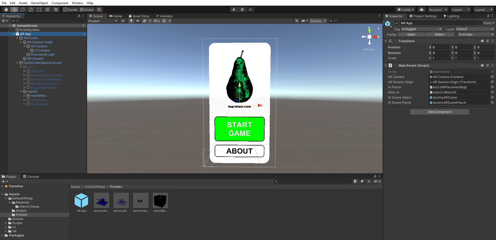
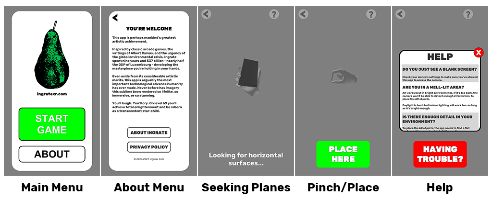
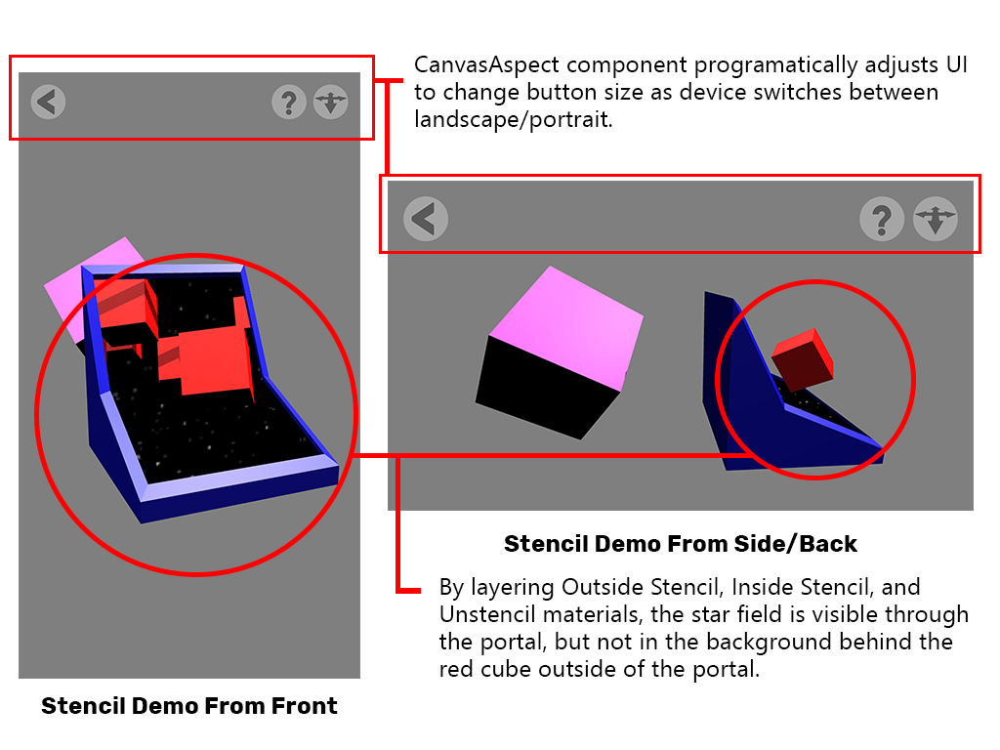

# Default Unity AR Project
This is a boilerplate structure for a Unity Android/iOS AR app. I use it as a
kind of AR-App-In-A-Box when starting a new Unity AR project so that I can get up and running quickly.
It has simple components that I use as jumping-off points to create more
customized implementations for any specific project's needs.  
  
The structure is set up to get a user to place an AR object or scene in their
environment. If that's not your use case - if your app is more like Pokemon Go
or Five Nights at Freddy's or something - this structure may not be very useful
to you.

To see apps that use variations of this setup, check out:
### St Nick
* [Android](https://play.google.com/store/apps/details?id=com.Ingrate.StNick)
* [iOS](https://apps.apple.com/us/app/saint-nick/id1547056442)
### Arcade Ingrate Vol 1
*Somewhat raunchy; may be NSFW if your place of employment is conservative.*
* [Android](https://play.google.com/store/apps/details?id=com.ingrate.arcadevol1)

## The Basic App
### Unity Project

### Basic UI

### Stencil Demo

The sample scene (Scenes/Sample Scene) has an AR App prefab to demonstrate the
simplest version of the structure. Building it gives you an app that looks
like this:

1. Opens on a simple non-AR menu:
    * A main page, a secondary page, a forced update page.
    * Menu structure can be easily extended to fit your project's specific
    needs.
    * The scripts for the menu/UI components are in Scripts/UI.
2. From the main page you can "start the game":
    * Prompts you to move the device so it can detect planes.
    * Once planes are detected, a "placer" object appears along with a prompt
    to pinch to zoom and rotate to spin it. 
    * Once you've got that object placed where you want it, hit the Place Object button and the placer object will be replaced by the AR scene.
    * After ten seconds of looking, if the device can't find any planes it
    will prompt you to open a simple troubleshooting menu that explains why it
    might be having trouble.
    * The meat of this functionality is in the ARPlacementMgr component and the
    ARPlacementUI component in the Scripts folder. These are a little bit hairy
    but are thoroughly commented and should make sense.

That's basically it. Replace the dummy AR Placer and AR Scene Object components
with whatever amazing AR stuff you want to put into the world and you'll have
a functioning app.

# Documentation
[Detailed Documentation](https://ingratexr.github.io/unity-ar-boilerplate/html/index.html)
## Scripts > Default AR App
### Main Parent
Sits at the root of the app. Controls whether the AR Placement UI or the Main UI
is active.

### AdMgr
Extremely basic implementation for using Unity Ads in an app.

### ARPlacementMgr / ARPlacementUI
These two components work together to prompt the user to place your AR scene or
object in space. The ARPlacementMgr looks for planes where your AR can be
placed. The ARPlacementUI responds to events that the ARPlacementMgr fires and
manages the UI to prompt the user accordingly.

### ARSceneObject / ARScenePlacer
These aren't components exactly, but the AR content you're going to place in the
scene. The ARPlacementMgr shows the Scene Placer to the user to indicate where
the AR will go. The user can move their device and pinch to scale or rotate the
placer, to put it where they want. Once they're happy with it and hit the Place
Here button, the ARPlacementMgr replaces the Scene Placer with the Scene Object.

The idea is that the scene object may have a bunch of characters and animations
and other content, so having a placement guide that looks obviously different
makes the UX more intuitive and easy to understand.

Set the Scene Object and Scene Placer in the MainParent component which is on
the root of the AR App prefab.

### ARPinchZoom / ARRotateGesture
These two components should sit on your AR Scene Placer object. When these are
active they let the user use two-finger gestures to resize and rotate the
scene's ARSessionOrigin object, which will make the whole scene resize and
rotate. These sit on the placer so that they're only active when the user is
trying to place the AR - they can't accidentally resize or rotate the game as
they're playing it.

### CamRaycastInput
Use the direction the device's camera is pointing as Left/Right steering input.
Sits on an object (typically a large invisible plane) and shoots out a raycast
from the center of the camera. If the raycast hits the object, figures out the
X-axis position (in local space) of that intersection, which can then be used
however you want (ie normalized to a range of -1, 1 to use as left/right input).

### CanvasAspect
Changes Unity's Canvas Scaler component on the mainScreenSpaceCanvas object to
adjust how much it matches the screen's width vs height. The idea is to make the
canvas responsive as the device changes from landscape to portrait and vice
versa, and to adjust programatically to different screen aspect ratios (eg an
iPhone X vs an iPad vs a Pixel).

### CopyCamera
Copies the main AR camera's projection matrix and applies it to another camera,
which it assumes is a child of the main AR camera. A typical use case for this
scenario is to have a main AR camera that renders everything except UI, and then
a child UI camera that renders only UI.

## Scripts > UI
### MainUI
Simple main menu component.

### AboutMenu
Simple about menu.

### ForceUpdate
Simple UI for forcing the user to update to a newer version of the app.

## Shaders
Some shaders I've created for different AR effects. Look at the prefab at
DefaultARApp/Prefabs/dummyObjectsForMaterials to see a simple demonstration of
how these work.

### Standard Double Sided
Standard Unity PBR shader, but with backside culling turned off.

### Spherical Frame
Takes a center point as a vector3 (in world space), a radius, a fade distance,
and a max alpha (0-1; 1 by default). Renders all pixels within radius distance
of center point with an opacity of maxAlpha. Renders all pixels further from
the center point than radius + fade distance as completely transparent. Lerps
the alpha of pixels in between these ranges from max alpha down to zero (so that
objects appear to fade out at the edge of the sphere).

### Hemispherical Frame
Just like the spherical frame shader except it creates a hemisphere/dome shape
instead of a sphere. Any pixels with a world space Y-axis location of less than
center point minus fade distance will be fully tranpsarent. Any pixels with a
world space Y-axis location of less than fade distance less than center point
will have their transparency lerped from max alpha to 0 (ie appear to fade out
the farther down they go). Any pixels with a world space Y-axis location equal
or greater than the center point will behave just like with the spherical frame.

### Transparent Shadow
Shader that's transparent but receives shadows. Use for otherwise-invisible
shadow catching planes.

## Shaders > Stencil Group
A collection of shaders that can be combined to create interesting portal-like
effects using Unity's stencil buffer. Check out the prefab at
DefaultARApp/Prefabs/stencilDemo to get an idea of what this looks like. Be
aware that the demo uses the DefaultARApp/Models/stencilDemo.fbx model, which
has the normals of some faces flipped around to create specific effects. It may
be hard or impossible to replicate the same kind of portal effect using Unity's
standard 3D objects where you can't control the normals.

*A Note About Naming*

These shaders are named in a logical way for my use case, which is for a
particular kind of portal effect. The "Outside" and "Inside" in the shader names
refer to the direction that the normals of the faces of stencil objects are
facing. So it may read like crazy but there's a system to it.

*Shaders For Objects:*

### Standard Stencil Filter
The same as Unity's standard PBR shader except it performs a stencil test. Use 
on objects that you either do or don't want to see through the stencil (set the
stencil test value on the material to Equal or NotEqual to set whether the
object will or won't render in the stenciled area of the screen).

### Standard Stencil Filter Fade
Same as Standard Stencil Filter except you can set the material's transparency.

### Standard Override
Same as Unity's standard PBR shader except the object will always render,
regardless of the ZTest/whether it should be occluded. Like having XRay
vision for objects with this shader on them.

### Unlit Transparent Stencil
Same as Standard Stencil Filter Fade except it's unlit.

### Unlit Transparent Stencil Double Sided
Same as Unlit Transparent Stencil except with backface culling turned off.

*Shaders For Stencils:*

### Outside Stencil
Writes to the stencil buffer to create the stencil area on screen regardless of
ZTest (ie you can't occlude the stencil area with another object/material).

### Outside Stencil Double Sided
Same as Outside Stencil except with backface culling turned off.

### Unstencil
Writes to the stencil buffer to create a stencil area on the screen, but writes
a different value (2) than the Outside Stencil (which writes 1). If BOTH 2 and 1
are written to the stencil buffer for a given pixel, objects with the stencil
shaders won't appear. (This unstencil shader is effectively a crude way of
negating the Outside Stencil effect.)

### Inside Stencil
Renders whatever has already rendered behind it. It doesn't actually use any
stencil logic. By overlapping objects using this shader with objects using the
stencil shaders, you can create an effect where Stencil objects appear in front
of Inside Stencil objects, but not behind them (ie you can see the foreground
but not the background). This effect will break if the objects render in the
wrong order in the render queue.

## UI
### Fonts
These are arbitrary and can be replaced with whatever you want. Go nuts.

### Sprites
These are just icons/logos/etc that I reuse a lot and want to have handy.

### Hand Animations
These are the animations for the prompts to 1) move your device around when
trying to detect planes, and 2) pinch to zoom/rotate. 
